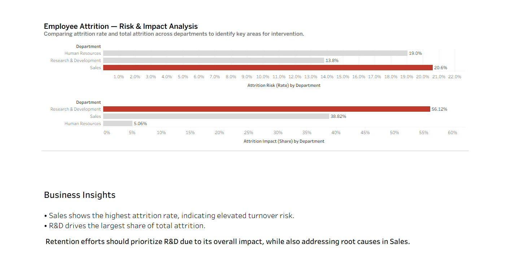

# Employee Attrition Analysis

HR analytics project analyzing employee attrition using SQL and Tableau.

## Project Overview

Employee attrition is a critical business issue because it affects workforce stability, productivity, hiring costs, and team continuity.  
This project explores attrition patterns across departments to identify where employee turnover risk is highest and where its overall organizational impact is greatest.

## Objective

The goal of this project is to answer two key business questions:

- Which department has the highest attrition risk?
- Which department contributes the largest share of total attrition?

By distinguishing between attrition **rate** and attrition **impact**, the analysis helps prioritize retention efforts more effectively.

## Tools Used

- SQL
- Tableau
- GitHub

## Project Structure

    employee-attrition-analysis/
    ├── README.md
    ├── DASHBORD.png
    └── sql/
        └── analysis.sql
        
## Dashboard Preview

